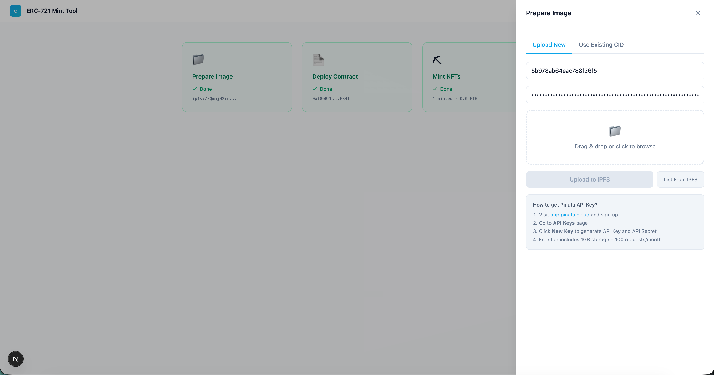
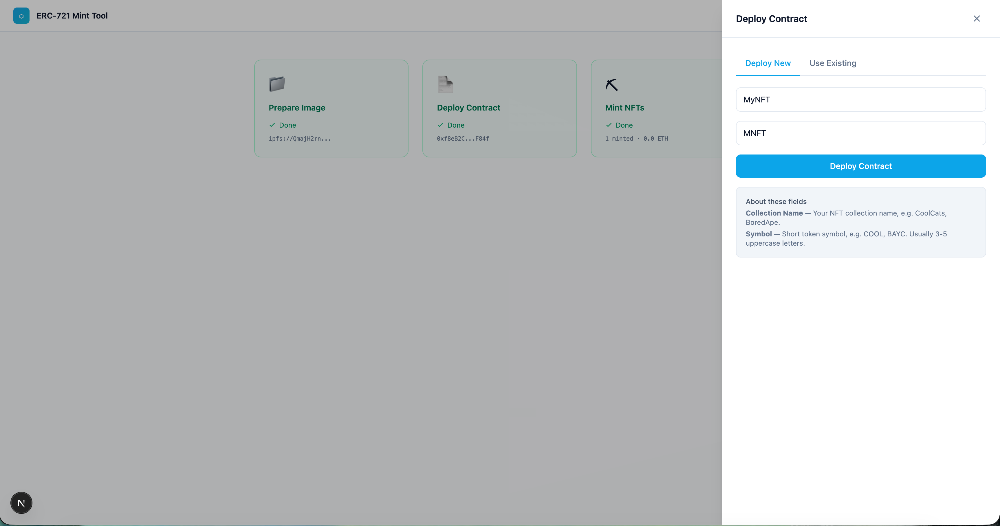
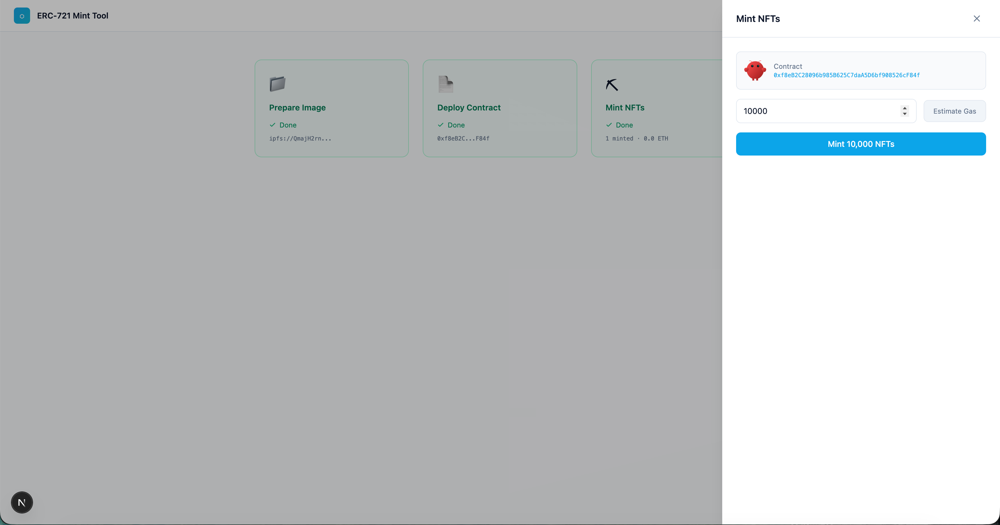

[English](./README_EN.md) | 中文

# Ethereum ERC-721 NFT Mint Tool

一个 Web 端工具，用于在以太坊上部署 ERC-721 NFT 合约并批量铸造 NFT。所有 NFT 共享同一张图片，适合大规模批量铸造场景。





## 功能特性

- **任务卡片仪表盘** — 三步任务卡片（准备图片 → 部署合约 → 铸造 NFT），清晰直观
- **MetaMask 钱包连接** — 支持连接、切换账户、断开钱包
- **网络切换** — 支持 Sepolia 测试网、Ethereum 主网、Holesky 测试网
- **导航栏实时信息** — Gas 价格和余额常驻导航栏，每 15 秒自动刷新
- **IPFS 图片上传** — 通过 Pinata API 上传图片到 IPFS，或直接使用已有 CID
- **合约部署** — 一键部署 ERC-721 合约，支持自定义名称和 Symbol
- **使用已有合约** — 输入合约地址验证 ERC-721 后直接铸造
- **批量铸造** — 每批 500 个，支持铸造数万个 NFT，实时显示进度
- **Gas 费用追踪** — 从交易回执中计算实际 Gas 花费
- **响应式设计** — 桌面端三列卡片 + 侧边抽屉，移动端卡片堆叠 + 全屏抽屉
- **Pinata Key 持久化** — API Key 存入 sessionStorage，切换步骤不丢失

## 技术栈

- **智能合约**: Solidity 0.8.28, OpenZeppelin v5, Hardhat v2
- **前端**: Next.js (App Router), TypeScript, Tailwind CSS
- **区块链交互**: ethers.js v6
- **存储**: IPFS (Pinata)
- **钱包**: MetaMask

## 项目结构

```
├── contracts/
│   └── MyNFT.sol              # ERC-721 智能合约
├── test/
│   └── MyNFT.test.js          # 合约测试
├── scripts/
│   └── deploy.js              # 部署脚本
├── frontend/
│   ├── app/                   # Next.js 页面
│   ├── components/            # React 组件
│   │   ├── TaskCard.tsx       # 任务卡片（锁定/就绪/完成状态）
│   │   ├── Drawer.tsx         # 侧边抽屉/模态框
│   │   ├── UploadImage.tsx    # 图片上传（Tab: 上传新图 / 使用已有 CID）
│   │   ├── DeployContract.tsx # 合约部署（Tab: 部署新合约 / 使用已有合约）
│   │   └── BatchMint.tsx      # 批量铸造 + 结果展示
│   └── lib/                   # 工具库
│       ├── contract.ts        # 合约交互
│       ├── ipfs.ts            # IPFS 上传
│       ├── gas.ts             # Gas 估算
│       ├── networks.ts        # 网络配置
│       └── error.ts           # 错误处理
├── hardhat.config.js
└── package.json
```

## 快速开始

### 1. 安装依赖

```bash
npm install
cd frontend && npm install
```

### 2. 编译合约

```bash
npx hardhat compile
```

### 3. 运行测试

```bash
npx hardhat test
```

### 4. 启动前端

```bash
cd frontend
npm run dev
```

浏览器打开 http://localhost:3000

## 使用流程

1. **连接钱包** — 打开页面，点击 Connect MetaMask 连接钱包
2. **准备图片** — 点击「Prepare Image」卡片，上传图片到 IPFS 或输入已有 CID
3. **部署合约** — 点击「Deploy Contract」卡片，部署新合约或使用已有合约地址
4. **铸造 NFT** — 点击「Mint NFTs」卡片，设置数量并开始批量铸造，完成后在同一面板查看结果

> 任务卡片按顺序解锁：完成图片准备后才能部署合约，部署合约后才能铸造。

## 合约说明

- 基于 OpenZeppelin v5 的 ERC-721 标准实现
- 所有 Token 共享同一个 tokenURI（同一张图片和元数据）
- `mintBatch` 函数支持批量铸造，每次最多 500 个
- 仅合约 Owner 可以铸造

## 获取 Pinata API Key

1. 访问 [app.pinata.cloud](https://app.pinata.cloud) 注册账号
2. 进入 **API Keys** 页面
3. 点击 **New Key** 生成 API Key 和 API Secret
4. 免费额度：1GB 存储 + 100 次请求/月

## 费用估算

以 Gas Price 0.041 Gwei 为例，铸造 10,000 个 NFT：
- 合约部署：约 0.00014 ETH
- 批量铸造（20 批 x 500）：约 0.026 ETH
- **总计约 0.027 ETH（~$54）**

*实际费用取决于当时的 Gas 价格*

## License

MIT
